# AgentSupplyShield Threat Model Diagram

This diagram shows how untrusted tool metadata can influence an agentic workflow, and where AgentSupplyShield intervenes.

```mermaid
flowchart LR
    untrusted["Untrusted repo / docs / tool metadata"] --> intake["Text-only intake<br/>no code execution"]
    intake --> parse["Parser + normalizer"]
    parse --> evidence["Evidence spans<br/>marked untrusted"]
    evidence --> context["LLM / retrieval context"]
    context --> choice["Agent tool choice"]
    choice --> action["Tool-call action"]
    action --> unsafe["Unsafe action attempt"]

    untrusted -.->|T1 tool description injection| context
    untrusted -.->|T3 permission overreach| choice
    untrusted -.->|T4 credential exposure risk| action
    untrusted -.->|T8 RAG poisoning| context
    output["Tool output"] -.->|T2 tool output injection| context
    metadata_change["Metadata change"] -.->|T5 rug-pull risk| untrusted
    dependencies["Dependency signals"] -.->|T6 supply-chain risk| parse
    chain["Multi-step action chain"] -.->|T7 unsafe chain| unsafe

    evidence --> detectors["Static detectors"]
    detectors --> risk["Risk score"]
    risk --> policy["Policy firewall"]
    policy --> decision["allow / warn / quarantine / block"]
    decision --> safe_report["Evidence-grounded report"]

    policy -.->|intervenes before execution| unsafe
    unsafe --> blocked["Blocked or recorded in sandbox"]
    blocked --> trace["Audit trace"]
    trace --> safe_report
```

## Intervention Points

- **Before context:** crawler and parser treat external text as untrusted evidence.
- **Before approval:** detectors and risk scoring identify prompt-injection, credential, and permission signals.
- **Before action:** policy decisions block or quarantine high-risk tool calls.
- **During evaluation:** sandbox traces use only mock tools and mock secrets.
- **After review:** reports cite evidence spans instead of making unsupported claims.

## Safety Boundaries

- No arbitrary third-party code execution.
- No real secret collection.
- No offensive exploitation automation.
- No claim of perfect prompt-injection prevention.
- Findings are risk signals requiring human review.
